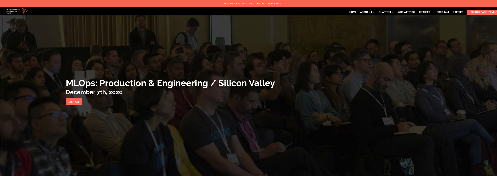

##  Toronto Machine Learning Workshop Materials for MLflow

This workshop has four modules. Each one is located in a separate directory with 
it respective README.md file and instructions how to follow the module.

**Note**: For modules 1-3, you'll need [Databricks Community Edition](https://databricks.com/try-databricks). Please register for this
before coming to class.

1. [MLflow Tracking](./tracking/README.md)
2. [MLFlow Projects](./projects/README.md)
3. [MLflow Models](./models/README.md)
4. [Model Registry](./model_registery/README.md)

Each module, except module 4, has [Databricks Community Edition](https://databricks.com/try-databricks) notebooks in its `dbc` format.
For module 4 (Model Registry), we'll use local host using Jupyter Notebooks. Please follow instructions for module
4 to setup your local host. To get most out of this workshop, I advice you register for the Databricks Community Edition 
(DCE) before the workshop.

Thank you, and I hope you enjoy the flow!

Cheers,

Jules S. Damji

